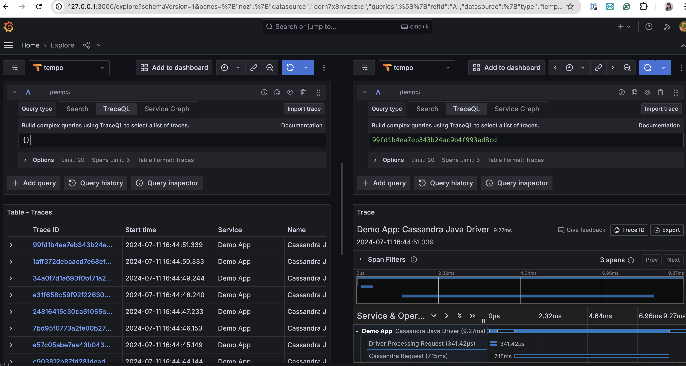

# Demo App for Integrating the Apache Cassandra Java Driver with OpenTelemetry for End-to-End Tracing
This is the material for the talk on CommunityOverCode Asia Summit 2024. 
# Installation
This guide assumes you have a working Java 8 environment, Maven, and Docker installed.
1. `git clone git@github.com:SiyaoIsHiding/otel-demo-coc.git` to clone this repository
2. Set up the Cassandra cluster either locally or on DataStax [Astra](https://astra.datastax.com/). Local cluster gives you more control. Astra Serverless is easier to set up. 
   - If you are setting it up locally, you need to install [CCM](https://github.com/riptano/ccm). If you are using Mac, `brew install ccm` should work. 
   - If you are using Mac, you need to set up loopback addresses. Run 
    ```bash
    sudo ifconfig lo0 alias 127.0.0.2 up
    sudo ifconfig lo0 alias 127.0.0.3 up
    ```
     When you are done playing with this demo app, you can remove the loopback addresses by running
    ```bash
    sudo ifconfig lo0 -alias 127.0.0.2 up
    sudo ifconfig lo0 -alias 127.0.0.3 up
   ```
   - Create a Cassandra cluster with 3 nodes by running `ccm create test-cl -v 4.1.5 -n 3`. 
     - If you are not using Apple Silicon, run `ccm start`.
     - If you are using Apple Silicon, you need to run the following commands:
     ```bash
     # solve the jna version issue
     mvn dependency:get -DgroupId=net.java.dev.jna -DartifactId=jna -Dversion=5.13.0
     rm ~/.ccm/repository/4.1.5/lib/jna-*
     cp ~/.m2/repository/net/java/dev/jna/jna/5.13.0/jna-5.13.0.jar ~/.ccm/repository/4.1.5/lib/
     # solve the stack size issue
     echo '-Xss640k' >> ~/.ccm/repository/4.1.5/conf/jvm8-server.options
     echo >> ~/.ccm/repository/4.1.5/conf/jvm8-server.options
     # Now run again, it should work
     ccm remove
     ccm create test-cl -v 4.1.5 -n 3
     ccm start
     ```
   - Now if you have `cqlsh`, you can run the command `cqlsh` to connect to the cluster. 
3. Run `docker compose up` to set up Tempo and Grafana, the traces storage and visualization tools.
4. Run `mvn compile exec:java -Dexec.mainClass="org.example.Main"` to run the demo app

# Explore Grafana
1. Open `http://localhost:3000` in your browser
2. Log in username `admin` and password `admin`
3. On your left sidebar, click "Connections" -> "Data Sources" -> "Add data source"
4. Choose "Tempo", type "http://tempo:3100" in the URL field, and click "Save & Test", it should say success
5. On your left sidebar, click "Explore", on your upper-left corner, choose "tempo" as data source
6. Select "TraceQL" as query type. Put `{}` as the query and click "Run Query". You should see the traces like below.



# To Introduce Delay to a Node
On Linux, you can use `tc` command, detailed instructions omitted here.

On Mac, you can use `pfctl`. Let's say you want to delay the traffic to and from 127.0.0.3:9042, you need to append the following two lines to `/etc/pf.conf`:
```
dummynet in quick on lo0 proto tcp from any to 127.0.0.3 port 9042 pipe 1
dummynet out quick on lo0 proto tcp from 127.0.0.3 port 9042 to any pipe 1
```
Next, run the following commands 
```bash
# apply the changes
sudo pfctl -f /etc/pf.conf
# create the delay
sudo dnctl pipe 1 config delay 100ms
# confirm the delay is created
sudo dnctl list
# enable pfctl
sudo pfctl -e
```
Later, if you want to disable it, run `sudo pfctl -d`.
